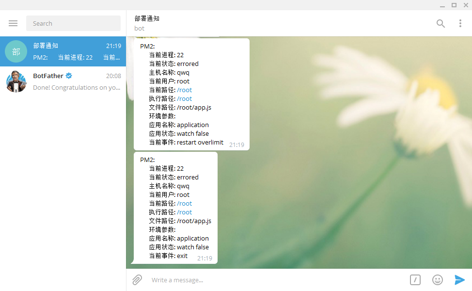

# PM2 telegram notify

## Use
```bash
npm install pm2 -g
pm2 install ipv4sec/pm2-telegram-notify
pm2 set pm2-telegram-notify:chatId {1234}
pm2 set pm2-telegram-notify:token {token}
```



### TODO

1. 应用频繁重启是控制只发送一条数据

### lint

`sh ./bin/tslint.sh` or  `gulp tslint`

### test

`sh ./bin/test.sh` or  `npm test`


### build

`sh ./bin/build.sh` or  `gulp build` or  `gulp watch-build`